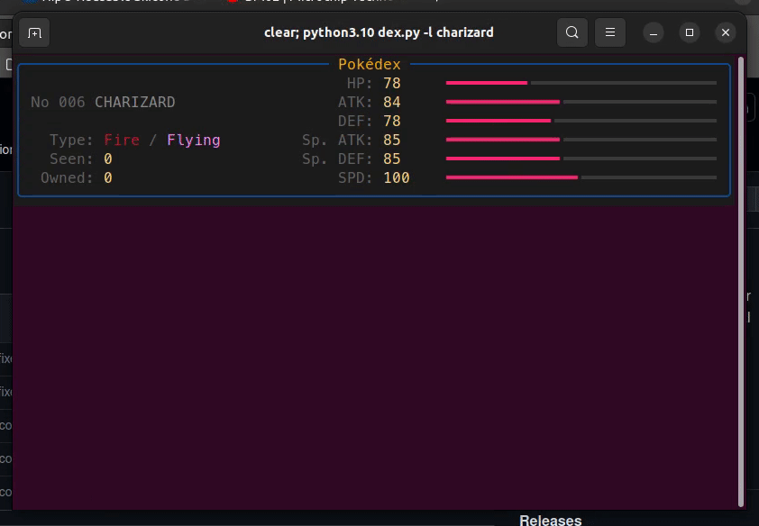

# Termidex

Termidex is a terminal-based Pokédex with animated stat bars.

Uses [Rich](https://github.com/Textualize/rich) for colorful displays and animated stat bars. I've only tested it on Windows Terminal, but Termidex should work on any OS as long as you have Python 3.7 or later.

Currently the Pokédex only contains gen 1 Pokémon.

### Usage

Look up a Pokémon by name:

`>>> python /path/to/dex.py --lookup growlithe`

Look up a Pokémon by gen 1 Pokédex number:

`>>> python /path/to/dex.py -l 58`

See info for a random Pokémon:

`>>> python /path/to/dex.py --random`

### Dependencies

- rich (I'm using v13.4.2)

### Resources

- Pokédex JSON file from [smogon.com](https://smogon.com)
- Rich's ["Dynamic Progress" example](https://github.com/Textualize/rich/blob/master/examples/dynamic_progress.py)
